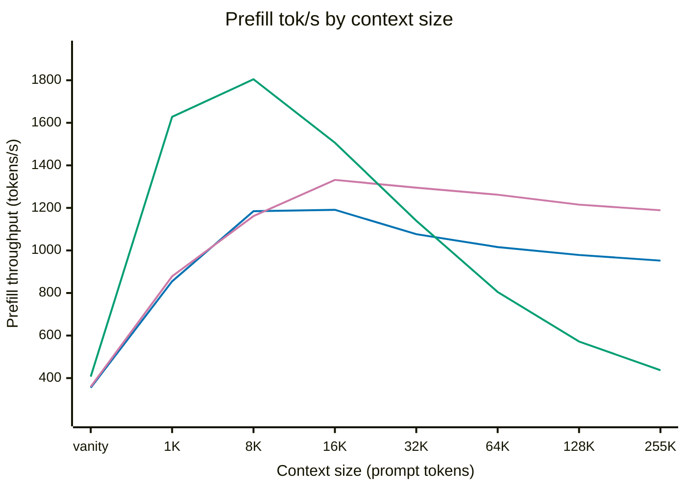
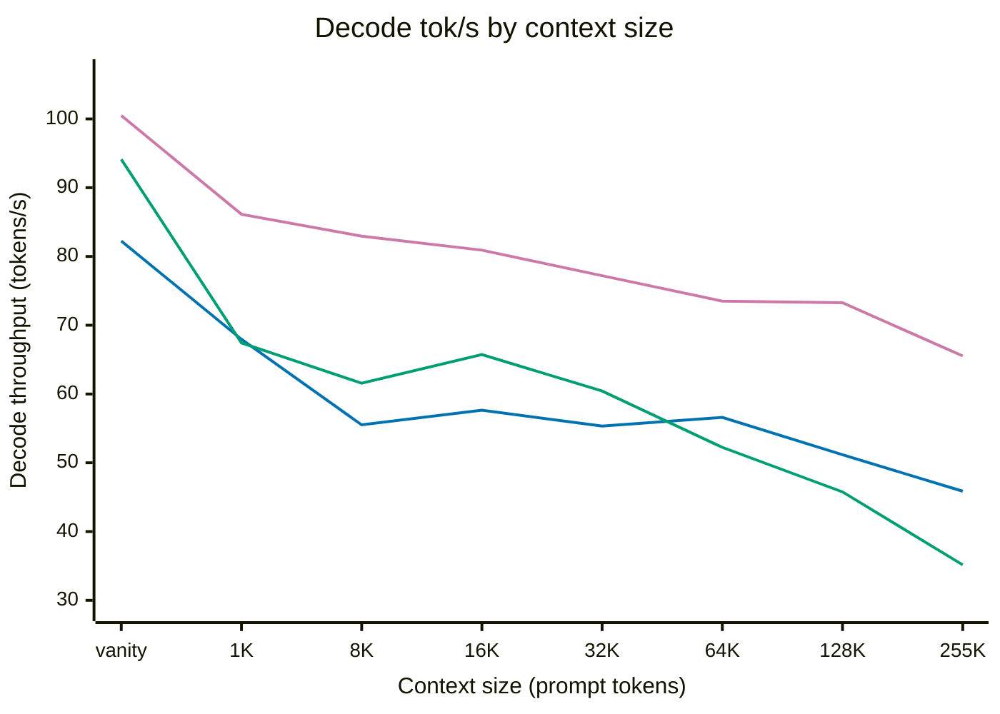
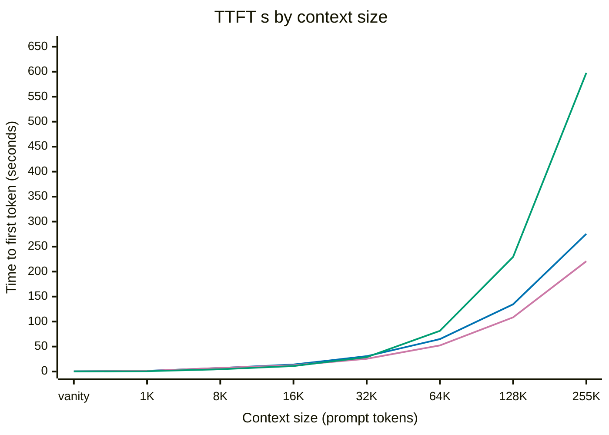
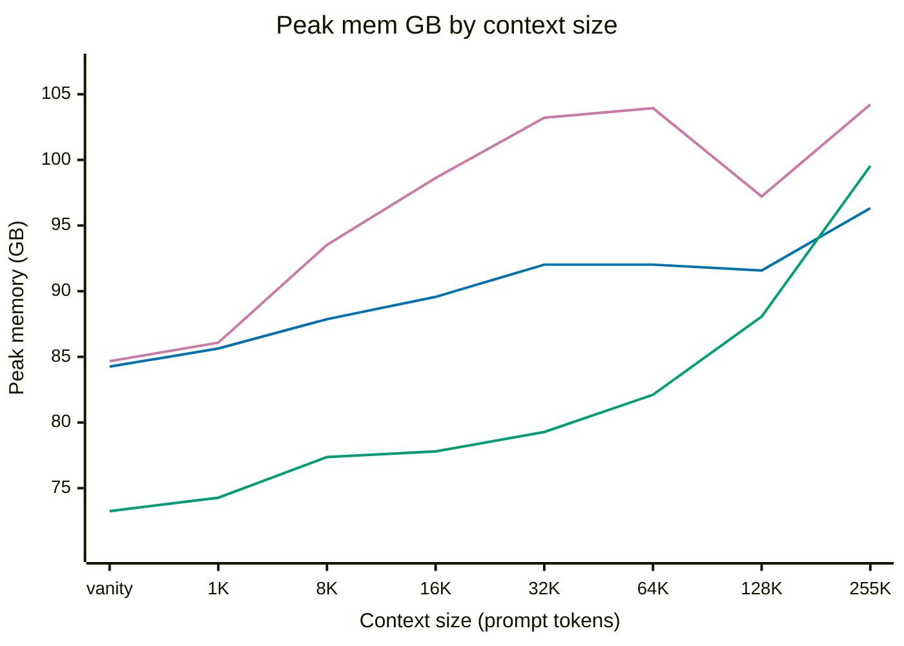
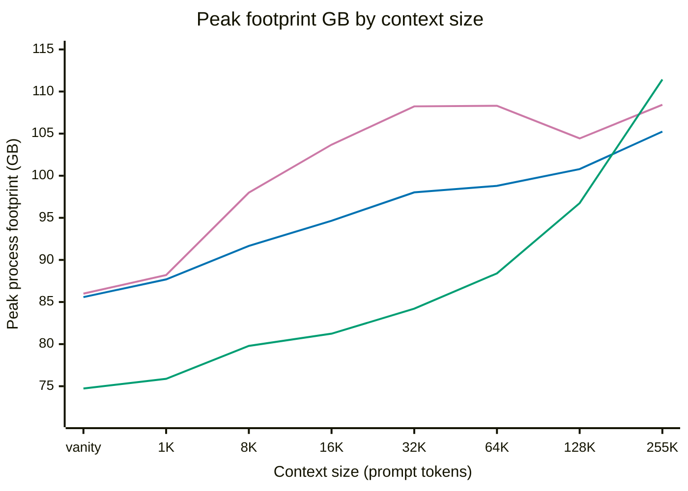
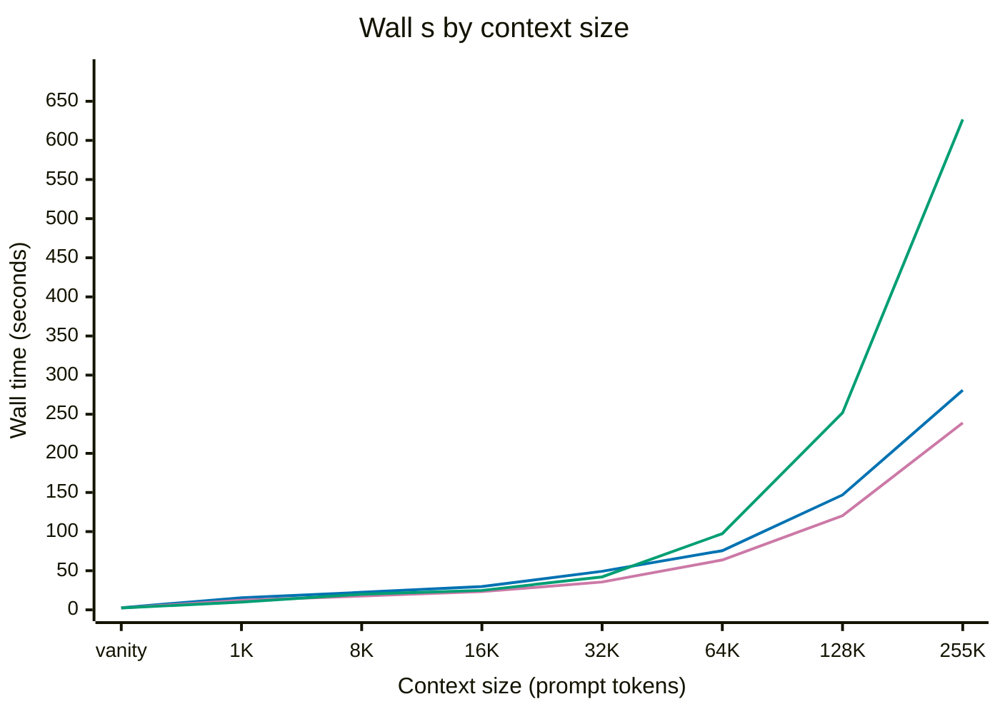
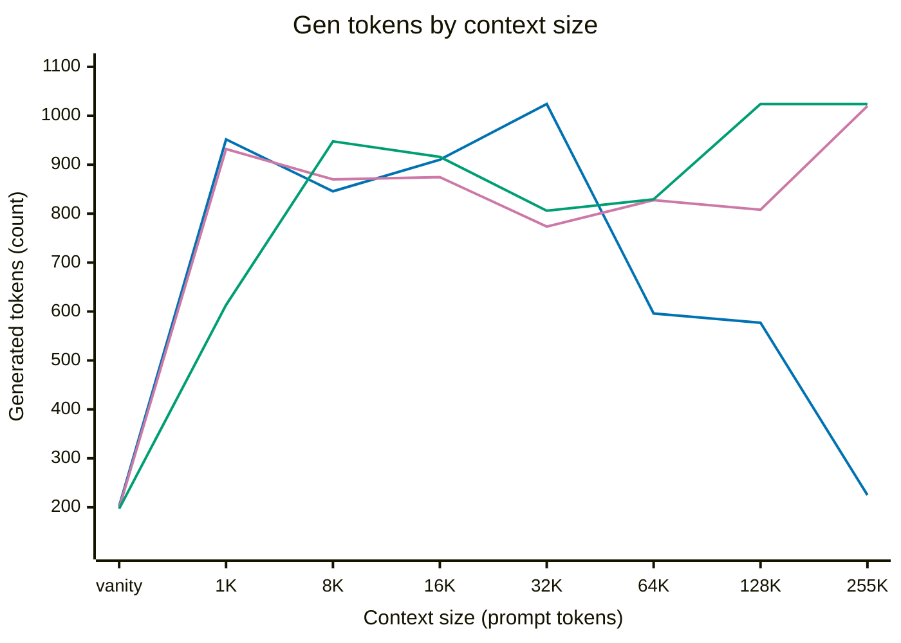
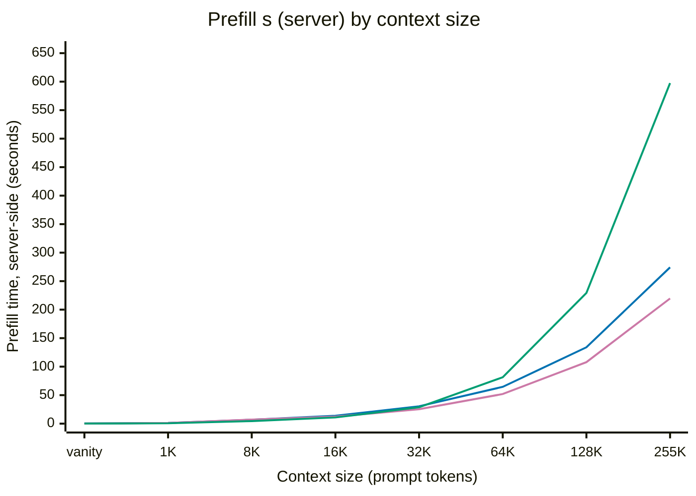

# PR #391 benchmark battery -- complete report

Rendered by `scripts/fable/server_cell_report.py` from the battery receipts and copied here verbatim by `assemble_body.py`. The pull request body quotes the five fields David asked for and the lead sentences of six footnotes; everything the renderer produced is below, including the footnotes the body does not name.

Source: `battery-report.md` (44,039 chars, sha256 `b6e447c76e955682`).

---
## Three-server comparison

_`n=` is the number of SEEDS behind each mean. The battery runs fewer seeds as the context grows, so the rows are not equally weighted: an `n=1` cell is a single measurement with no spread at all, not a mean. Per-cell counts are in F-seeds._

**Prefill tok/s**  _(higher is better)_

| Cell | upstream v2.10.2 (control) | branch (+FR-Spec, +compiled MTP prepare, +restack) | Δ% | mlx-serve 26.8.11 | Δ% |
| --- | ---: | ---: | ---: | ---: | ---: |
| vanity | 355±24 _n=3_ | 359±24 _n=3_ | +1.2% | 407±7 _n=3_ | +14.7% |
| 1K | 855±64 _n=3_ | 878±73 _n=3_ | +2.7% | 1,628±41 _n=3_ | +90.4% |
| 8K | 1,185±17 _n=3_ | 1,161±69 _n=3_ | -2.0% | 1,805±21 _n=3_ | +52.3% |
| 16K | 1,191±8 _n=3_ | 1,332±25 _n=3_ | +11.8% | 1,507±5 _n=3_ | +26.5% |
| 32K | 1,077±3 _n=3_ | 1,295±8 _n=3_ | +20.3% | 1,140±0 _n=3_ | +5.9% |
| 64K | 1,016±10 _n=3_ | 1,262±2 _n=3_ | +24.2% | 805±1 _n=3_ | -20.8% |
| 128K | 979±7 _n=2_ | 1,215±0 _n=2_ | +24.2% | 572±0 _n=2_ | -41.6% |
| 255K | 952 _n=1_ | 1,189 _n=1_ | +24.9% | 437 _n=1_ | -54.1% |

**Decode tok/s**  _(higher is better)_

| Cell | upstream v2.10.2 (control) | branch (+FR-Spec, +compiled MTP prepare, +restack) | Δ% | mlx-serve 26.8.11 | Δ% |
| --- | ---: | ---: | ---: | ---: | ---: |
| vanity | 82.25 (79.55-85.82) _n=3_ | 100.49 (95.78-104.11) _n=3_ | +22.2% | 94.13 (89.85-99.88) _n=3_ | +14.4% |
| 1K | 67.95 (66.20-71.24) _n=3_ | 86.13 (82.27-93.65) _n=3_ | +26.8% | 67.43 (62.80-74.75) _n=3_ | -0.8% |
| 8K | 55.51 (52.34-59.16) _n=3_ | 82.95 (78.87-86.17) _n=3_ | +49.4% | 61.57 (61.22-62.20) _n=3_ | +10.9% |
| 16K | 57.65 (56.14-58.72) _n=3_ | 80.92 (77.13-83.75) _n=3_ | +40.4% | 65.73 (63.40-68.89) _n=3_ | +14.0% |
| 32K | 55.34 (54.01-57.86) _n=3_ | 77.20 (74.96-78.58) _n=3_ | +39.5% | 60.43 (58.73-63.58) _n=3_ | +9.2% |
| 64K | 56.60 (52.75-62.26) _n=3_ | 73.50 (69.23-79.93) _n=3_ | +29.9% | 52.24 (50.33-53.28) _n=3_ | -7.7% |
| 128K | 51.17 (49.95-52.39) _n=2_ | 73.27 (70.42-76.11) _n=2_ | +43.2% | 45.77 (43.24-48.29) _n=2_ | -10.6% |
| 255K | 45.86 _n=1_ | 65.53 _n=1_ | +42.9% | 35.15 _n=1_ | -23.4% |

**TTFT s**  _(lower is better)_

| Cell | upstream v2.10.2 (control) | branch (+FR-Spec, +compiled MTP prepare, +restack) | Δ% | mlx-serve 26.8.11 | Δ% |
| --- | ---: | ---: | ---: | ---: | ---: |
| vanity | 0.265±0.037 _n=3_ | 0.263±0.036 _n=3_ | -0.9% | 0.238±0.004 _n=3_ | -10.5% |
| 1K | 1.397±0.084 _n=3_ | 1.319±0.095 _n=3_ | -5.6% | 0.654±0.016 _n=3_ | -53.2% |
| 8K | 7.121±0.083 _n=3_ | 7.256±0.432 _n=3_ | +1.9% | 4.572±0.054 _n=3_ | -35.8% |
| 16K | 13.972±0.089 _n=3_ | 12.495±0.234 _n=3_ | -10.6% | 10.914±0.039 _n=3_ | -21.9% |
| 32K | 30.718±0.077 _n=3_ | 25.542±0.156 _n=3_ | -16.9% | 28.796±0.011 _n=3_ | -6.3% |
| 64K | 64.936±0.632 _n=3_ | 52.266±0.094 _n=3_ | -19.5% | 81.485±0.097 _n=3_ | +25.5% |
| 128K | 134.589±1.033 _n=2_ | 108.402±0.048 _n=2_ | -19.5% | 229.331±0.162 _n=2_ | +70.4% |
| 255K | 275.476 _n=1_ | 220.629 _n=1_ | -19.9% | 597.681 _n=1_ | +117.0% |

**Peak mem GB**  _(lower is better)_

| Cell | upstream v2.10.2 (control) | branch (+FR-Spec, +compiled MTP prepare, +restack) | Δ% | mlx-serve 26.8.11 | Δ% |
| --- | ---: | ---: | ---: | ---: | ---: |
| vanity | 84.26±0.13 _n=3_ | 84.67±0.06 _n=3_ | +0.5% | 73.25±0.00 _n=3_ | -13.1% |
| 1K | 85.63±0.36 _n=3_ | 86.08±0.70 _n=3_ | +0.5% | 74.27±0.00 _n=3_ | -13.3% |
| 8K | 87.87 _n=3_ | 93.53±1.78 _n=3_ | +6.4% | 77.37±0.00 _n=3_ | -12.0% |
| 16K | 89.57±0.00 _n=3_ | 98.62±0.73 _n=3_ | +10.1% | 77.80±0.00 _n=3_ | -13.1% |
| 32K | 92.02±0.00 _n=3_ | 103.21±1.03 _n=3_ | +12.2% | 79.28 _n=3_ | -13.9% |
| 64K | 92.03±0.00 _n=3_ | 103.94 _n=3_ | +12.9% | 82.11±0.00 _n=3_ | -10.8% |
| 128K | 91.58±0.00 _n=2_ | 97.22±0.01 _n=2_ | +6.2% | 88.07 _n=2_ | -3.8% |
| 255K | 96.33 _n=1_ | 104.22 _n=1_ | +8.2% | 99.54 _n=1_ | +3.3% |

**Peak footprint GB**  _(lower is better)_

| Cell | upstream v2.10.2 (control) | branch (+FR-Spec, +compiled MTP prepare, +restack) | Δ% | mlx-serve 26.8.11 | Δ% |
| --- | ---: | ---: | ---: | ---: | ---: |
| vanity | 85.58±0.01 _n=3_ | 86.00±0.03 _n=3_ | +0.5% | 74.73±0.46 _n=3_ | -12.7% |
| 1K | 87.69±0.21 _n=3_ | 88.20±0.73 _n=3_ | +0.6% | 75.88±0.55 _n=3_ | -13.5% |
| 8K | 91.67±0.91 _n=3_ | 97.99±2.11 _n=3_ | +6.9% | 79.79±0.02 _n=3_ | -13.0% |
| 16K | 94.65±0.47 _n=3_ | 103.69±1.12 _n=3_ | +9.6% | 81.24±0.02 _n=3_ | -14.2% |
| 32K | 98.02±0.14 _n=3_ | 108.24±0.02 _n=3_ | +10.4% | 84.21±0.04 _n=3_ | -14.1% |
| 64K | 98.80±0.33 _n=3_ | 108.31±0.02 _n=3_ | +9.6% | 88.40±0.03 _n=3_ | -10.5% |
| 128K | 100.79±0.01 _n=2_ | 104.43±1.56 _n=2_ | +3.6% | 96.75±0.00 _n=2_ | -4.0% |
| 255K | 105.24 _n=1_ | 108.42 _n=1_ | +3.0% | 111.44 _n=1_ | +5.9% |

**Wall s**  _(lower is better)_

| Cell | upstream v2.10.2 (control) | upstream v2.10.2 (control) gen tok | branch (+FR-Spec, +compiled MTP prepare, +restack) | branch (+FR-Spec, +compiled MTP prepare, +restack) gen tok | Δ% | mlx-serve 26.8.11 | mlx-serve 26.8.11 gen tok | Δ% |
| --- | ---: | ---: | ---: | ---: | ---: | ---: | ---: | ---: |
| vanity | 2.72 (2.16-3.35) _n=3_ | 202 (152-254) | 2.26 (1.97-2.49) _n=3_ | 199 (178-212) | -16.9% | 2.34 (2.04-2.51) _n=3_ | 197 (181-210) | -14.0% |
| 1K | 15.46 (12.79-16.90) _n=3_ | 952 (807-1,024) | 12.24 (9.74-13.64) _n=3_ | 932 (793-1,024) | -20.8% | 9.88 (6.75-15.93) _n=3_ | 613 (396-991) | -36.1% |
| 8K | 22.38 (20.56-25.83) _n=3_ | 846 (704-1,024) | 17.67 (14.11-19.75) _n=3_ | 870 (562-1,024) | -21.0% | 19.94 (17.50-21.34) _n=3_ | 948 (795-1,024) | -10.9% |
| 16K | 29.73 (26.29-31.53) _n=3_ | 910 (696-1,024) | 23.26 (20.25-25.34) _n=3_ | 875 (610-1,024) | -21.8% | 24.84 (23.60-25.62) _n=3_ | 916 (806-986) | -16.5% |
| 32K | 49.28 (48.38-49.81) _n=3_ | 1,024 (1,024-1,024) | 35.57 (31.41-38.87) _n=3_ | 774 (442-1,024) | -27.8% | 42.14 (38.92-46.14) _n=3_ | 806 (595-1,024) | -14.5% |
| 64K | 75.65 (74.95-76.68) _n=3_ | 596 (557-672) | 63.73 (58.53-67.42) _n=3_ | 828 (435-1,024) | -15.8% | 97.37 (93.31-100.88) _n=3_ | 829 (632-1,024) | +28.7% |
| 128K | 146.87 (145.79-147.94) _n=2_ | 577 (483-671) | 120.31 (117.75-122.88) _n=2_ | 808 (592-1,024) | -18.1% | 251.75 (250.35-253.15) _n=2_ | 1,024 (1,024-1,024) | +71.4% |
| 255K | 280.66 _n=1_ | 225 | 238.97 _n=1_ | 1,020 | -14.9% | 626.78 _n=1_ | 1,024 | +123.3% |

**Prefill s (server)**  _(lower is better)_

| Cell | upstream v2.10.2 (control) | branch (+FR-Spec, +compiled MTP prepare, +restack) | Δ% | mlx-serve 26.8.11 | Δ% |
| --- | ---: | ---: | ---: | ---: | ---: |
| vanity | 0.246±0.017 _n=3_ | 0.243±0.017 _n=3_ | -1.2% | 0.214±0.004 _n=3_ | -13.2% |
| 1K | 1.205±0.094 _n=3_ | 1.174±0.103 _n=3_ | -2.5% | 0.629±0.016 _n=3_ | -47.8% |
| 8K | 6.916±0.100 _n=3_ | 7.079±0.436 _n=3_ | +2.4% | 4.540±0.054 _n=3_ | -34.4% |
| 16K | 13.756±0.097 _n=3_ | 12.308±0.230 _n=3_ | -10.5% | 10.875±0.038 _n=3_ | -20.9% |
| 32K | 30.437±0.098 _n=3_ | 25.305±0.153 _n=3_ | -16.9% | 28.754±0.011 _n=3_ | -5.5% |
| 64K | 64.526±0.652 _n=3_ | 51.929±0.090 _n=3_ | -19.5% | 81.426±0.096 _n=3_ | +26.2% |
| 128K | 133.936±0.970 _n=2_ | 107.844±0.043 _n=2_ | -19.5% | 229.238±0.161 _n=2_ | +71.2% |
| 255K | 274.227 _n=1_ | 219.629 _n=1_ | -19.9% | 597.501 _n=1_ | +117.9% |

**Per-seed decode tok/s** (spread, not just the mean)

| Cell | Server | per-seed values | mean | sd | min | max |
| --- | --- | --- | ---: | ---: | ---: | ---: |
| vanity | upstream-2.10.2 | 85.82, 79.55, 81.40 | 82.25 | 2.63 | 79.55 | 85.82 |
| vanity | branch-fullstack | 95.78, 104.11, 101.58 | 100.49 | 3.49 | 95.78 | 104.11 |
| vanity | mlx-serve | 92.65, 89.85, 99.88 | 94.13 | 4.23 | 89.85 | 99.88 |
| 1K | upstream-2.10.2 | 71.24, 66.43, 66.20 | 67.95 | 2.32 | 66.20 | 71.24 |
| 1K | branch-fullstack | 82.27, 82.48, 93.65 | 86.13 | 5.32 | 82.27 | 93.65 |
| 1K | mlx-serve | 74.75, 64.75, 62.80 | 67.43 | 5.23 | 62.80 | 74.75 |
| 8K | upstream-2.10.2 | 55.04, 59.16, 52.34 | 55.51 | 2.81 | 52.34 | 59.16 |
| 8K | branch-fullstack | 86.17, 83.81, 78.87 | 82.95 | 3.04 | 78.87 | 86.17 |
| 8K | mlx-serve | 61.28, 61.22, 62.20 | 61.57 | 0.45 | 61.22 | 62.20 |
| 16K | upstream-2.10.2 | 58.72, 56.14, 58.09 | 57.65 | 1.10 | 56.14 | 58.72 |
| 16K | branch-fullstack | 81.88, 77.13, 83.75 | 80.92 | 2.79 | 77.13 | 83.75 |
| 16K | mlx-serve | 68.89, 64.91, 63.40 | 65.73 | 2.32 | 63.40 | 68.89 |
| 32K | upstream-2.10.2 | 54.14, 57.86, 54.01 | 55.34 | 1.78 | 54.01 | 57.86 |
| 32K | branch-fullstack | 78.58, 78.06, 74.96 | 77.20 | 1.60 | 74.96 | 78.58 |
| 32K | mlx-serve | 58.73, 63.58, 58.98 | 60.43 | 2.23 | 58.73 | 63.58 |
| 64K | upstream-2.10.2 | 62.26, 52.75, 54.79 | 56.60 | 4.09 | 52.75 | 62.26 |
| 64K | branch-fullstack | 69.23, 71.34, 79.93 | 73.50 | 4.63 | 69.23 | 79.93 |
| 64K | mlx-serve | 50.33, 53.28, 53.12 | 52.24 | 1.35 | 50.33 | 53.28 |
| 128K | upstream-2.10.2 | 52.39, 49.95 | 51.17 | 1.22 | 49.95 | 52.39 |
| 128K | branch-fullstack | 76.11, 70.42 | 73.27 | 2.85 | 70.42 | 76.11 |
| 128K | mlx-serve | 43.24, 48.29 | 45.77 | 2.52 | 43.24 | 48.29 |
| 255K | upstream-2.10.2 | 45.86 | 45.86 | 0.00 | 45.86 | 45.86 |
| 255K | branch-fullstack | 65.53 | 65.53 | 0.00 | 65.53 | 65.53 |
| 255K | mlx-serve | 35.15 | 35.15 | 0.00 | 35.15 | 35.15 |

## Prefill scaling

**Prefill fit** `prefill_s = intercept + slope x prompt_tokens`, least squares over the cell means.

| Server | Intercept (fixed cost) | Slope (marginal) | R^2 | worst residual |
| --- | ---: | ---: | ---: | ---: |
| upstream-2.10.2 | -2,237 ms | 1052.231 us/token | 0.99958 | +2.392 s |
| branch-fullstack | -1,012 ms | 840.031 us/token | 0.99966 | -2.111 s |
| mlx-serve | -27,249 ms | 2268.901 us/token | 0.97949 | -40.902 s |

```
  upstream-2.10.2:
         87 tok  measured   0.246s  fit  -2.145s  resid +2.392s
      1,024 tok  measured   1.205s  fit  -1.159s  resid +2.364s
      8,192 tok  measured   6.916s  fit   6.383s  resid +0.533s
     16,384 tok  measured  13.756s  fit  15.003s  resid -1.247s
     32,768 tok  measured  30.437s  fit  32.243s  resid -1.806s
     65,536 tok  measured  64.526s  fit  66.722s  resid -2.196s
    131,072 tok  measured 133.936s  fit 135.681s  resid -1.745s
    261,120 tok  measured 274.227s  fit 272.522s  resid +1.705s
  branch-fullstack:
         87 tok  measured   0.243s  fit  -0.939s  resid +1.182s
      1,024 tok  measured   1.174s  fit  -0.152s  resid +1.326s
      8,192 tok  measured   7.079s  fit   5.869s  resid +1.210s
     16,384 tok  measured  12.308s  fit  12.751s  resid -0.443s
     32,768 tok  measured  25.305s  fit  26.514s  resid -1.209s
     65,536 tok  measured  51.929s  fit  54.040s  resid -2.111s
    131,072 tok  measured 107.844s  fit 109.092s  resid -1.249s
    261,120 tok  measured 219.629s  fit 218.337s  resid +1.292s
  mlx-serve:
         87 tok  measured   0.214s  fit -27.051s  resid +27.265s
      1,024 tok  measured   0.629s  fit -24.925s  resid +25.555s
      8,192 tok  measured   4.540s  fit  -8.662s  resid +13.202s
     16,384 tok  measured  10.875s  fit   9.925s  resid +0.951s
     32,768 tok  measured  28.754s  fit  47.098s  resid -18.345s
     65,536 tok  measured  81.426s  fit 121.446s  resid -40.020s
    131,072 tok  measured 229.238s  fit 270.141s  resid -40.902s
    261,120 tok  measured 597.501s  fit 565.207s  resid +32.295s
```

### Footnotes (generated)

- **F1 packs differ.** MTPLX serves `Youssofal--Qwen3.8-Flash-Next-MTPLX-Optimized-Speed` (137 GB, 4-bit gs32, 8-bit gs64 lm_head/embed); mlx-serve serves `ddalcu/Qwen3.8-Flash-Next-MLX-Serve-4bit` (98 GB, uniform 4-bit gs64). ~40% more weight at a finer group size explains much of the memory and part of the decode gap. **MTPLX-vs-mlx-serve is engine PLUS pack; branch-vs-upstream is pack-clean and is what this PR is about.**
- **F2 draft depth differs.** Effective depth per arm: `branch-fullstack`=3, `mlx-serve`=adaptive (up to 6-8), `upstream-2.10.2`=3. MTPLX is hard-pinned; mlx-serve's `--mtp` leaves depth adaptive (logs show depth=6 with an EV controller re-planning per round). Never present as an unqualified engine comparison.
- **F4 prefill scope is comparable.** mlx-serve brackets `runPrefill` alone and reports tokenise separately as `tokenize_ms`; MTPLX starts its timer at generator entry on already-tokenized ids. Both exclude cached tokens from the denominator, so `Prefill s` / `Prefill tok/s` are the same quantity on all three. TTFT is client-measured on all three. This is a footnote, not a caveat.
- **F-parity every engine was asked for the same thing.** All 21 cell(s) run on more than one engine carry an IDENTICAL per-cell request digest across `branch-fullstack`, `mlx-serve`, `upstream-2.10.2` (`request_body_sha256`: every body field but `model`). Response side: thinking observed on `branch-fullstack` 18/18 sweep cells, `mlx-serve` 18/18 sweep cells, `upstream-2.10.2` 18/18 sweep cells; vanity thought on no engine; finish reasons `branch-fullstack` ['length', 'stop'], `mlx-serve` ['length', 'stop'], `upstream-2.10.2` ['length', 'stop']. **`branch-fullstack` accepts `top_p+top_k order` but honours it only yes, but top_p is applied BEFORE top_k**: Both values are applied verbatim, but the FILTER ORDER differs from mlx-serve, which applies top_k first (generate.zig:8026 then :8034 on the AR path, :7663 then :7669 on the MTP verify path). At top_k=20 / top_p=0.95 the two orders can admit different candidate sets, so this is a real difference in the sampled distribution, not a formality. It is inherent to the engines and is not something the request can equalise. (mtplx/sampling.py:121-130 -- 'Local mlx_lm applies top-p before top-k, so MTPLX's NumPy reference path mirrors that order') Remedy: disclose it. Sending only ONE of the two would remove the difference, but it would also change the sampler the model ships with, so the honest move is the footnote rather than a quieter benchmark. **`branch-fullstack` accepts `top_p+top_k order` but honours it only yes, but top_p is applied BEFORE top_k**: Both values are applied verbatim, but the FILTER ORDER differs from mlx-serve, which applies top_k first (generate.zig:8026 then :8034 on the AR path, :7663 then :7669 on the MTP verify path). At top_k=20 / top_p=0.95 the two orders can admit different candidate sets, so this is a real difference in the sampled distribution, not a formality. It is inherent to the engines and is not something the request can equalise. (mtplx/sampling.py:121-130 -- 'Local mlx_lm applies top-p before top-k, so MTPLX's NumPy reference path mirrors that order') Remedy: disclose it. Sending only ONE of the two would remove the difference, but it would also change the sampler the model ships with, so the honest move is the footnote rather than a quieter benchmark. **`branch-fullstack` accepts `top_p+top_k order` but honours it only yes, but top_p is applied BEFORE top_k**: Both values are applied verbatim, but the FILTER ORDER differs from mlx-serve, which applies top_k first (generate.zig:8026 then :8034 on the AR path, :7663 then :7669 on the MTP verify path). At top_k=20 / top_p=0.95 the two orders can admit different candidate sets, so this is a real difference in the sampled distribution, not a formality. It is inherent to the engines and is not something the request can equalise. (mtplx/sampling.py:121-130 -- 'Local mlx_lm applies top-p before top-k, so MTPLX's NumPy reference path mirrors that order') Remedy: disclose it. Sending only ONE of the two would remove the difference, but it would also change the sampler the model ships with, so the honest move is the footnote rather than a quieter benchmark. **`mlx-serve` accepts `top_p+top_k order` but honours it only yes, but top_k is applied BEFORE top_p**: The opposite order to both MTPLX arms, which apply top_p first (mtplx/sampling.py:121-130). At top_k=20 / top_p=0.95 the two orders can admit different candidate sets. Applies on the AR path and on the MTP verify distribution alike. (generate.zig:8026 then :8034 (sampleTokenLazy), and :7663 then :7669 (probsAllPositions) -- mlx-serve v26.8.11 / 5afa398) Remedy: disclose it; no request field reorders an engine's own sampler. **`mlx-serve` accepts `seed` but honours it only partial**: The AR sampler and the accept-test PRNG ARE seeded (generate.zig:8054 seedKey, generate.zig:2422). But the correction/bonus token committed on EVERY MTP round is drawn with a null key -- MLX's process-global RNG, seeded once from the wall clock at main.zig:1078. So under --mtp a seeded request is NOT reproducible, and the harness runs mlx-serve with --mtp. (generate.zig:5268-5277, and the DEFAULT batched arm generate.zig:4827-4831 (mlx-serve v26.8.11 / 5afa398)) Remedy: no request field and no server flag fixes it. The seeded control is --mlxserve-no-mtp, which this harness already offers. Otherwise disclose it: mlx-serve's three seeds are REPEATS, not reproductions, and its spread is a sample of run-to-run variance rather than a seed effect. **`mlx-serve` accepts `top_p+top_k order` but honours it only yes, but top_k is applied BEFORE top_p**: The opposite order to both MTPLX arms, which apply top_p first (mtplx/sampling.py:121-130). At top_k=20 / top_p=0.95 the two orders can admit different candidate sets. Applies on the AR path and on the MTP verify distribution alike. (generate.zig:8026 then :8034 (sampleTokenLazy), and :7663 then :7669 (probsAllPositions) -- mlx-serve v26.8.11 / 5afa398) Remedy: disclose it; no request field reorders an engine's own sampler. **`mlx-serve` accepts `seed` but honours it only partial**: The AR sampler and the accept-test PRNG ARE seeded (generate.zig:8054 seedKey, generate.zig:2422). But the correction/bonus token committed on EVERY MTP round is drawn with a null key -- MLX's process-global RNG, seeded once from the wall clock at main.zig:1078. So under --mtp a seeded request is NOT reproducible, and the harness runs mlx-serve with --mtp. (generate.zig:5268-5277, and the DEFAULT batched arm generate.zig:4827-4831 (mlx-serve v26.8.11 / 5afa398)) Remedy: no request field and no server flag fixes it. The seeded control is --mlxserve-no-mtp, which this harness already offers. Otherwise disclose it: mlx-serve's three seeds are REPEATS, not reproductions, and its spread is a sample of run-to-run variance rather than a seed effect. **`mlx-serve` accepts `top_p+top_k order` but honours it only yes, but top_k is applied BEFORE top_p**: The opposite order to both MTPLX arms, which apply top_p first (mtplx/sampling.py:121-130). At top_k=20 / top_p=0.95 the two orders can admit different candidate sets. Applies on the AR path and on the MTP verify distribution alike. (generate.zig:8026 then :8034 (sampleTokenLazy), and :7663 then :7669 (probsAllPositions) -- mlx-serve v26.8.11 / 5afa398) Remedy: disclose it; no request field reorders an engine's own sampler. **`mlx-serve` accepts `seed` but honours it only partial**: The AR sampler and the accept-test PRNG ARE seeded (generate.zig:8054 seedKey, generate.zig:2422). But the correction/bonus token committed on EVERY MTP round is drawn with a null key -- MLX's process-global RNG, seeded once from the wall clock at main.zig:1078. So under --mtp a seeded request is NOT reproducible, and the harness runs mlx-serve with --mtp. (generate.zig:5268-5277, and the DEFAULT batched arm generate.zig:4827-4831 (mlx-serve v26.8.11 / 5afa398)) Remedy: no request field and no server flag fixes it. The seeded control is --mlxserve-no-mtp, which this harness already offers. Otherwise disclose it: mlx-serve's three seeds are REPEATS, not reproductions, and its spread is a sample of run-to-run variance rather than a seed effect. **`upstream-2.10.2` accepts `top_p+top_k order` but honours it only yes, but top_p is applied BEFORE top_k**: Both values are applied verbatim, but the FILTER ORDER differs from mlx-serve, which applies top_k first (generate.zig:8026 then :8034 on the AR path, :7663 then :7669 on the MTP verify path). At top_k=20 / top_p=0.95 the two orders can admit different candidate sets, so this is a real difference in the sampled distribution, not a formality. It is inherent to the engines and is not something the request can equalise. (mtplx/sampling.py:121-130 -- 'Local mlx_lm applies top-p before top-k, so MTPLX's NumPy reference path mirrors that order') Remedy: disclose it. Sending only ONE of the two would remove the difference, but it would also change the sampler the model ships with, so the honest move is the footnote rather than a quieter benchmark. **`upstream-2.10.2` accepts `top_p+top_k order` but honours it only yes, but top_p is applied BEFORE top_k**: Both values are applied verbatim, but the FILTER ORDER differs from mlx-serve, which applies top_k first (generate.zig:8026 then :8034 on the AR path, :7663 then :7669 on the MTP verify path). At top_k=20 / top_p=0.95 the two orders can admit different candidate sets, so this is a real difference in the sampled distribution, not a formality. It is inherent to the engines and is not something the request can equalise. (mtplx/sampling.py:121-130 -- 'Local mlx_lm applies top-p before top-k, so MTPLX's NumPy reference path mirrors that order') Remedy: disclose it. Sending only ONE of the two would remove the difference, but it would also change the sampler the model ships with, so the honest move is the footnote rather than a quieter benchmark. **`upstream-2.10.2` accepts `top_p+top_k order` but honours it only yes, but top_p is applied BEFORE top_k**: Both values are applied verbatim, but the FILTER ORDER differs from mlx-serve, which applies top_k first (generate.zig:8026 then :8034 on the AR path, :7663 then :7669 on the MTP verify path). At top_k=20 / top_p=0.95 the two orders can admit different candidate sets, so this is a real difference in the sampled distribution, not a formality. It is inherent to the engines and is not something the request can equalise. (mtplx/sampling.py:121-130 -- 'Local mlx_lm applies top-p before top-k, so MTPLX's NumPy reference path mirrors that order') Remedy: disclose it. Sending only ONE of the two would remove the difference, but it would also change the sampler the model ships with, so the honest move is the footnote rather than a quieter benchmark.
- **F-version engine builds, receipt-preferred.** 3/3 arm(s) recorded their own version; the rest fall back to the hand-maintained string in the renderer and are marked as such. `branch-fullstack`: **2.10.1** (mlx 0.32.2, git 5c62e89d9fe6) from the receipt (`importlib.metadata:mtplx`); `mlx-serve`: **26.8.11** (mlx 0.32.2) from the receipt (`mlx-serve --version`); `upstream-2.10.2`: **2.10.2** (mlx 0.32.2, git 8bc4d88e421d) from the receipt (`importlib.metadata:mtplx`).
- **F-mtp mlx-serve's controller switched its own speculative decoding off during some requests.** vanity: speculation active in 12 of 18 requests, pooled accept 49.3% (4680/9487 tok), 0.83 tok/round. Both MTPLX arms ran MTP depth 3 throughout. `runtime_disabled` is the state at the END of a request, so tokens generated before the controller gave up were still speculated -- read this as "speculation disabled at some point during the request", NOT as "speculation abandoned". The mixed picture matters: at 16K, the headline cell, speculation was live in 2 of 3 requests. It does mean the sweep decode column is not a clean MTP-vs-MTP comparison, and it leaves open whether pinning `--mtp-depth 3` would help at all if the controller disables speculation anyway.
- **F-eng engagement provenance is asymmetric, by disclosure not by deletion.** MTPLX drafted/accepted counts were not written into the <=16K records (the harness computed them and dropped them before writing); they are recorded from the 32K cells and the branch full-stack re-run onward. mlx-serve's <=16K engagement IS recoverable and has been scraped from its retained per-cell logs, and is marked **log-derived** in the engagement table. MTPLX's <=16K cells read `not_recorded`. Upstream's <=16K cells stay footnoted rather than re-run.
- **F-cap mlx-serve ran at MEMORY PARITY, not at its own defaults.** `MLX_SERVE_CACHE_LIMIT=107374182400` (100 GiB) was set on every cell at every size, matching the 100 GiB cap on both MTPLX arms. mlx-serve's SHIPPED default pool cap is **8 GB** (its startup line reads `[mem] MLX buffer-pool cap 8192 MB`), so these numbers are not what an out-of-the-box mlx-serve would produce. Note this is MLX's reclaimable buffer pool, matched numerically to the MTPLX wired cap rather than being the same kind of limit.
- **F-auto the branch auto-arms four M4 routes at SERVER DEFAULTS; upstream cannot.** `mtplx/server/openai.py:846-869` stamps `MTPLX_COMPILED_VERIFY`, `MTPLX_QWEN4_FIXED_M4_VERIFY`, `MTPLX_QWEN4_M4_STAGE3` and `MTPLX_QSA_M4_FUSED_KV_GATHER` via `setdefault` whenever `_served_model_is_qwen4_fixed_m4()` holds; the predicate (`qwen4_fixed_verify.py:25`) pins one exact geometry and returns **True** for the served pack. Upstream v2.10.2 has no such block (zero references to any of the four). An explicit operator export still wins. **So both branch rows already contain the M4 stack, and 'server defaults' does NOT mean the same thing on the two arms** -- the difference between the branch rows is frspec plus the MTPLX_FABLE_* switches, not M4. Corroborated without any log: `BRANCH_ENV` sets the three `MTPLX_QWEN4_M4_ROUTED_*` children but not stage3, and `qwen4_m4_stage3.py:231-236` raises `ValueError("qwen4 M4 child routes require M4 stage3")` on that combination via `runtime.py:1104`; the branch server booted cleanly in every cell, so stage3 was on.
  - **Resolved Fable flag set per branch arm, read from each receipt's own `fable_flags` block** -- the `--fable-flags-file` resolution, which is the `MTPLX_FABLE_*` tuning set plus any other `MTPLX_` key a flags file named. Keys sorted, values as launched:
    - `branch-fullstack` -- branch (+FR-Spec, +compiled MTP prepare, +restack)
      - cells vanity, 1K, 8K, 16K, 32K, 64K, 128K, 255K -- from flag file(s): `stack.flags` (sha256 `73b63272`, 12 key(s)), `battery-prefill.flags` (sha256 `f02e6895`, 8 key(s))
        - decode keys (14): `MTPLX_FABLE_BLOCK_VERIFY=1`, `MTPLX_FABLE_DRAFT_K20_PRESCATTER=1`, `MTPLX_FABLE_GRAPH_BUILD_OVERLAP=1`, `MTPLX_FABLE_GRAPH_BUILD_OVERLAP_LAYERS=3`, `MTPLX_FABLE_HC_M4=1`, `MTPLX_FABLE_OPDIET=1`, `MTPLX_FABLE_PLE_FIRST_GATHER_EARLY=1`, `MTPLX_FABLE_QSA_SPARSE_DECODE=1`, `MTPLX_FABLE_QSA_SPARSE_DECODE_SPLITS=17`, `MTPLX_FABLE_QSA_SPARSE_DECODE_TILE=128:32`, `MTPLX_FABLE_ROUTE_KERNEL=1`, `MTPLX_FABLE_VERIFY_GLUE=1`, `MTPLX_FABLE_VERIFY_GLUE_ITEMS=qsa_rope,qsa_rope_idx`, `MTPLX_SESSION_BANK_MAX_BYTES=8G`
        - prefill keys (6): `MTPLX_FABLE_PLE_PREFILL_LOOKAHEAD=1`, `MTPLX_FABLE_PREFILL_MASK_FUSE=1`, `MTPLX_FABLE_PREFILL_QSA_QUERY_TILE=2048`, `MTPLX_GDN_BLOCKED_PREFILL=1`, `MTPLX_PREFILL_CHUNK_SIZE=4096`, `MTPLX_QSA_PREFILL_COMPILE_ROWS=4096`
        - boot keys (1, applied to every branch arm; a boot requirement, not retained tuning): `MTPLX_FABLE_PREFILL_CHUNK_ALLOW_COMPILE_ROWS_MISMATCH=1`
        - **`dropped_vs_default` (1)**: `MTPLX_FABLE_COMPILED_DRAFT` -- in the harness default set, not named by the flag file(s), so **OFF** on this run.
- **F-fan cooling regime constant across every cell: fans at max.** Recorded per cell and in each session header.
- **F-seeds the rows are NOT equally weighted.** Seeds per cell, from the records: **vanity**: `branch-fullstack` n=3, `mlx-serve` n=3, `upstream-2.10.2` n=3; **1K**: `branch-fullstack` n=3, `mlx-serve` n=3, `upstream-2.10.2` n=3; **8K**: `branch-fullstack` n=3, `mlx-serve` n=3, `upstream-2.10.2` n=3; **16K**: `branch-fullstack` n=3, `mlx-serve` n=3, `upstream-2.10.2` n=3; **32K**: `branch-fullstack` n=3, `mlx-serve` n=3, `upstream-2.10.2` n=3; **64K**: `branch-fullstack` n=3, `mlx-serve` n=3, `upstream-2.10.2` n=3; **128K**: `branch-fullstack` n=2, `mlx-serve` n=2, `upstream-2.10.2` n=2; **255K**: `branch-fullstack` n=1, `mlx-serve` n=1, `upstream-2.10.2` n=1. The battery drops seeds as the context grows, so 6 cell(s) carry fewer than the 3 seeds the smallest cells got: 128K/branch-fullstack, 128K/mlx-serve, 128K/upstream-2.10.2, 255K/branch-fullstack, 255K/mlx-serve, 255K/upstream-2.10.2. A one-seed cell is a single measurement -- it has no spread, its `±`/range is absent by construction rather than by agreement, and it must not be read as the same kind of mean as a three-seed row. Every value in the tables carries its own `n=`.
- **F7 most branch switches are launch-env only.** Only `MTPLX_PREFILL_CHUNK_SIZE` and `MTPLX_GDN_BLOCKED_PREFILL` echo an engagement line; the rest are unverifiable from the server's output, and 15 of 20 are bare `os.environ.get` with defaults, so a typo silently no-ops.
- **PAGING** flagged in: branch-fullstack/128K, branch-fullstack/16K, branch-fullstack/1K, branch-fullstack/255K, branch-fullstack/32K, branch-fullstack/64K, branch-fullstack/8K, branch-fullstack/vanity, mlx-serve/128K, mlx-serve/16K, mlx-serve/1K, mlx-serve/255K, mlx-serve/32K, mlx-serve/64K, mlx-serve/8K, mlx-serve/vanity, upstream-2.10.2/128K, upstream-2.10.2/16K, upstream-2.10.2/1K, upstream-2.10.2/255K, upstream-2.10.2/32K, upstream-2.10.2/64K, upstream-2.10.2/8K — these cells are paging cells and must not be averaged in.

## Charts

### Prefill tok/s



_Series in plotting order (xychart-beta draws no legend, so the colours are pinned by the `plotColorPalette` directive at the top of the block): **1st line, blue `#0072B2`** = upstream v2.10.2 (control); **2nd line, reddish purple `#CC79A7`** = branch (+FR-Spec, +compiled MTP prepare, +restack); **3rd line, bluish green `#009E73`** = mlx-serve 26.8.11._

### Decode tok/s



_Series in plotting order (xychart-beta draws no legend, so the colours are pinned by the `plotColorPalette` directive at the top of the block): **1st line, blue `#0072B2`** = upstream v2.10.2 (control); **2nd line, reddish purple `#CC79A7`** = branch (+FR-Spec, +compiled MTP prepare, +restack); **3rd line, bluish green `#009E73`** = mlx-serve 26.8.11._

### TTFT s



_Series in plotting order (xychart-beta draws no legend, so the colours are pinned by the `plotColorPalette` directive at the top of the block): **1st line, blue `#0072B2`** = upstream v2.10.2 (control); **2nd line, reddish purple `#CC79A7`** = branch (+FR-Spec, +compiled MTP prepare, +restack); **3rd line, bluish green `#009E73`** = mlx-serve 26.8.11._

### Peak mem GB



_Series in plotting order (xychart-beta draws no legend, so the colours are pinned by the `plotColorPalette` directive at the top of the block): **1st line, blue `#0072B2`** = upstream v2.10.2 (control); **2nd line, reddish purple `#CC79A7`** = branch (+FR-Spec, +compiled MTP prepare, +restack); **3rd line, bluish green `#009E73`** = mlx-serve 26.8.11._

### Peak footprint GB



_Series in plotting order (xychart-beta draws no legend, so the colours are pinned by the `plotColorPalette` directive at the top of the block): **1st line, blue `#0072B2`** = upstream v2.10.2 (control); **2nd line, reddish purple `#CC79A7`** = branch (+FR-Spec, +compiled MTP prepare, +restack); **3rd line, bluish green `#009E73`** = mlx-serve 26.8.11._

### Wall s



_Series in plotting order (xychart-beta draws no legend, so the colours are pinned by the `plotColorPalette` directive at the top of the block): **1st line, blue `#0072B2`** = upstream v2.10.2 (control); **2nd line, reddish purple `#CC79A7`** = branch (+FR-Spec, +compiled MTP prepare, +restack); **3rd line, bluish green `#009E73`** = mlx-serve 26.8.11._

### Gen tokens



_Series in plotting order (xychart-beta draws no legend, so the colours are pinned by the `plotColorPalette` directive at the top of the block): **1st line, blue `#0072B2`** = upstream v2.10.2 (control); **2nd line, reddish purple `#CC79A7`** = branch (+FR-Spec, +compiled MTP prepare, +restack); **3rd line, bluish green `#009E73`** = mlx-serve 26.8.11._

### Prefill s (server)



_Series in plotting order (xychart-beta draws no legend, so the colours are pinned by the `plotColorPalette` directive at the top of the block): **1st line, blue `#0072B2`** = upstream v2.10.2 (control); **2nd line, reddish purple `#CC79A7`** = branch (+FR-Spec, +compiled MTP prepare, +restack); **3rd line, bluish green `#009E73`** = mlx-serve 26.8.11._

## Run conditions (per cell)

| Server | Cell | Power | Fan mode | Fan RPM | Max °C | Pressure | Memory source |
| --- | --- | --- | --- | --- | ---: | --- | --- |
| branch-fullstack | 128K | AC | manual | 5339, 5786 | 79.4 | unknown | server:peak_memory_bytes |
| branch-fullstack | 16K | AC | manual | 5348, 5769 | 67.7 | unknown | server:peak_memory_bytes |
| branch-fullstack | 1K | AC | manual | 5349, 5780 | 60.1 | unknown | server:peak_memory_bytes |
| branch-fullstack | 255K | AC | manual | 5348, 5766 | 81.7 | unknown | server:peak_memory_bytes |
| branch-fullstack | 32K | AC | manual | 5351, 5787 | 73.4 | unknown | server:peak_memory_bytes |
| branch-fullstack | 64K | AC | manual | 5346, 5775 | 75.3 | unknown | server:peak_memory_bytes |
| branch-fullstack | 8K | AC | manual | 5346, 5780 | 63.3 | unknown | server:peak_memory_bytes |
| branch-fullstack | vanity | AC | manual | 5346, 5780 | 47.4 | unknown | server:peak_memory_bytes |
| mlx-serve | 128K | AC | manual | 5351, 5770 | 74.6 | unknown | server:/props peak_bytes |
| mlx-serve | 16K | AC | manual | 5347, 5774 | 66.2 | unknown | server:/props peak_bytes |
| mlx-serve | 1K | AC | manual | 5347, 5778 | 60.9 | unknown | server:/props peak_bytes |
| mlx-serve | 255K | AC | manual | 5354, 5780 | 74.4 | unknown | server:/props peak_bytes |
| mlx-serve | 32K | AC | manual | 5346, 5786 | 72.1 | unknown | server:/props peak_bytes |
| mlx-serve | 64K | AC | manual | 5347, 5777 | 74.7 | unknown | server:/props peak_bytes |
| mlx-serve | 8K | AC | manual | 5348, 5773 | 62.6 | unknown | server:/props peak_bytes |
| mlx-serve | vanity | AC | manual | 5344, 5771 | 45.3 | unknown | server:/props peak_bytes |
| upstream-2.10.2 | 128K | AC | manual | 5344, 5769 | 77.2 | unknown | server:peak_memory_bytes |
| upstream-2.10.2 | 16K | AC | manual | 5347, 5779 | 68.1 | unknown | server:peak_memory_bytes |
| upstream-2.10.2 | 1K | AC | manual | 5351, 5769 | 58.1 | unknown | server:peak_memory_bytes |
| upstream-2.10.2 | 255K | AC | manual | 5343, 5781 | 78.9 | unknown | server:peak_memory_bytes |
| upstream-2.10.2 | 32K | AC | manual | 5343, 5785 | 75.4 | unknown | server:peak_memory_bytes |
| upstream-2.10.2 | 64K | AC | manual | 5352, 5781 | 74.8 | unknown | server:peak_memory_bytes |
| upstream-2.10.2 | 8K | AC | manual | 5351, 5775 | 62.8 | unknown | server:peak_memory_bytes |
| upstream-2.10.2 | vanity | AC | manual | 5347, 5773 | 46.8 | unknown | server:peak_memory_bytes |

## Engagement (from responses, not launch flags)

**mlx-serve speculative decoding, per timed request** (log-derived; MTPLX has no equivalent for these cells, see F-eng)

| Cell | Request | Speculation | Source |
| --- | ---: | --- | --- |
| vanity | 1 | active | log:battery-mlxserve-A.server.log |
| vanity | 2 | active | log:battery-mlxserve-A.server.log |
| vanity | 3 | active | log:battery-mlxserve-A.server.log |
| vanity | 4 | active | log:battery-mlxserve-A.server.log |
| vanity | 5 | active | log:battery-mlxserve-A.server.log |
| vanity | 6 | active | log:battery-mlxserve-A.server.log |
| vanity | 7 | active | log:battery-mlxserve-A.server.log |
| vanity | 8 | active | log:battery-mlxserve-A.server.log |
| vanity | 9 | **disabled by end** | log:battery-mlxserve-A.server.log |
| vanity | 10 | active | log:battery-mlxserve-A.server.log |
| vanity | 11 | **disabled by end** | log:battery-mlxserve-A.server.log |
| vanity | 12 | **disabled by end** | log:battery-mlxserve-A.server.log |
| vanity | 13 | active | log:battery-mlxserve-A.server.log |
| vanity | 14 | active | log:battery-mlxserve-A.server.log |
| vanity | 15 | **disabled by end** | log:battery-mlxserve-A.server.log |
| vanity | 16 | **disabled by end** | log:battery-mlxserve-A.server.log |
| vanity | 17 | active | log:battery-mlxserve-A.server.log |
| vanity | 18 | **disabled by end** | log:battery-mlxserve-A.server.log |
| 128K | 1 | active | log:battery-mlxserve-C.server.log |

| Server | Cell | Engagement | Provenance |
| --- | --- | --- | --- |
| branch-fullstack | 128K | receipt: {"accept_rate": 0.5023, "accepted_drafts": 327, "drafted_tokens": 651, "generation_mode": "mtp"} | receipt |
| branch-fullstack | 16K | receipt: {"accept_rate": 0.5577, "accepted_drafts": 594, "drafted_tokens": 1065, "generation_mode": "mtp"} | receipt |
| branch-fullstack | 1K | receipt: {"accept_rate": 0.5358, "accepted_drafts": 389, "drafted_tokens": 726, "generation_mode": "mtp"} | receipt |
| branch-fullstack | 255K | receipt: {"accept_rate": 0.5252, "accepted_drafts": 594, "drafted_tokens": 1131, "generation_mode": "mtp"} | receipt |
| branch-fullstack | 32K | receipt: {"accept_rate": 0.4699, "accepted_drafts": 234, "drafted_tokens": 498, "generation_mode": "mtp"} | receipt |
| branch-fullstack | 64K | receipt: {"accept_rate": 0.5115, "accepted_drafts": 532, "drafted_tokens": 1040, "generation_mode": "mtp"} | receipt |
| branch-fullstack | 8K | receipt: {"accept_rate": 0.4401, "accepted_drafts": 272, "drafted_tokens": 618, "generation_mode": "mtp"} | receipt |
| branch-fullstack | vanity | receipt: {"accept_rate": 0.7473, "accepted_drafts": 139, "drafted_tokens": 186, "generation_mode": "mtp"} | receipt |
| mlx-serve | 128K | receipt: {"predicted_n": 1024, "prompt_n": 131072} | receipt |
| mlx-serve | 16K | receipt: {"predicted_n": 806, "prompt_n": 16384} | receipt |
| mlx-serve | 1K | receipt: {"predicted_n": 396, "prompt_n": 1024} | receipt |
| mlx-serve | 255K | receipt: {"predicted_n": 1024, "prompt_n": 261120} | receipt |
| mlx-serve | 32K | receipt: {"predicted_n": 1024, "prompt_n": 32768} | receipt |
| mlx-serve | 64K | receipt: {"predicted_n": 1024, "prompt_n": 65536} | receipt |
| mlx-serve | 8K | receipt: {"predicted_n": 1024, "prompt_n": 8192} | receipt |
| mlx-serve | vanity | receipt: {"predicted_n": 181, "prompt_n": 87} | receipt |
| upstream-2.10.2 | 128K | receipt: {"accept_rate": 0.463, "accepted_drafts": 375, "drafted_tokens": 810, "generation_mode": "mtp"} | receipt |
| upstream-2.10.2 | 16K | receipt: {"accept_rate": 0.5026, "accepted_drafts": 585, "drafted_tokens": 1164, "generation_mode": "mtp"} | receipt |
| upstream-2.10.2 | 1K | receipt: {"accept_rate": 0.5, "accepted_drafts": 546, "drafted_tokens": 1092, "generation_mode": "mtp"} | receipt |
| upstream-2.10.2 | 255K | receipt: {"accept_rate": 0.4958, "accepted_drafts": 119, "drafted_tokens": 240, "generation_mode": "mtp"} | receipt |
| upstream-2.10.2 | 32K | receipt: {"accept_rate": 0.4624, "accepted_drafts": 566, "drafted_tokens": 1224, "generation_mode": "mtp"} | receipt |
| upstream-2.10.2 | 64K | receipt: {"accept_rate": 0.4857, "accepted_drafts": 306, "drafted_tokens": 630, "generation_mode": "mtp"} | receipt |
| upstream-2.10.2 | 8K | receipt: {"accept_rate": 0.4437, "accepted_drafts": 378, "drafted_tokens": 852, "generation_mode": "mtp"} | receipt |
| upstream-2.10.2 | vanity | receipt: {"accept_rate": 0.7717, "accepted_drafts": 169, "drafted_tokens": 219, "generation_mode": "mtp"} | receipt |
