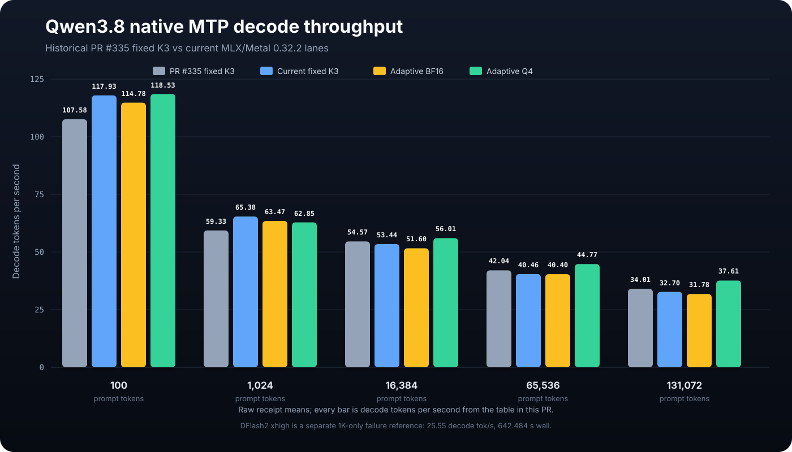

# Qwen3.8 native-MTP adaptive-depth receipt

This receipt covers the native-MTP-only port of the adaptive depth work from
[PR #335](https://github.com/youssofal/MTPLX/pull/335). It does not route through
the external DFlash2 drafter.

## Result at a glance

- Ship adaptive BF16 as an opt-in policy; keep fixed BF16 K3 as the default.
- Adaptive BF16 regressed all four exact-1K-output rows and won only the
  single-pass 128K xhigh row.
- Adaptive Q4 won 16K, 64K, and 128K at low reasoning and all four xhigh rows
  by wall time. It remains experimental until its artifact is published and a
  supported installation contract exists.
- The 100-token greedy vanity result was effectively tied: adaptive Q4 was
  0.05% faster by wall time than current fixed K3.

| Candidate | Exact-1K-output wall gate | Xhigh 16K-output wall gate | Outcome |
|---|---|---|---|
| Adaptive BF16 | 0/4 wins | 1/4 wins | Keep opt-in; do not make default |
| Adaptive Q4 | 3/4 wins | 4/4 wins | Retain as experimental artifact lane |

The 100-token vanity prompt is reported separately because it stops naturally
at 102 tokens rather than using either matrix's fixed output length.

## Candidates

- `control`: the Optimized-Speed model's stock BF16 native-MTP blocks at fixed
  K=3.
- `adaptive`: the same BF16 native-MTP blocks with
  `--adaptive-policy position_ema` (`r11_position_ema`).
- `q4 adaptive`: the same policy with the retained experimental Q4 MTP block
  (`r11_position_ema+r28_q4_mtp_block`). This artifact is benchmark-only and is
  not installed or selected by this PR.

The benchmarked runtime and harness commit is
`e29eff720ebaa1f21451d5e5c61736ab7cb34a49`. MLX and Metal were both 0.32.2.
Every paired matrix used a fresh process per arm under the parent GPU lock, in
the symmetric order `control-adaptive-q4-q4-adaptive-control`. The 128K xhigh
row is one pass per candidate, by explicit benchmark-plan decision.

The comparison includes the PR #335 100-token greedy palindrome prompt and its
four longer Python prompt sizes. The current 1K through 128K rows time exactly
1,024 output tokens; the 100-token rows reach the same natural stop at 102
tokens. All paired current arms were token-deterministic within each candidate.

The tables report raw throughput and timing. Positive wall deltas mean faster
than the fixed-K3 control. Peak memory is the maximum observed arm in GiB.

## Low-reasoning comparison matrix

| Prompt | Candidate | Generated | Prefill tok/s | Decode tok/s | Wall (s) | Wall vs current fixed K3 | Peak GiB |
|---:|---|---:|---:|---:|---:|---:|---:|
| 100 | PR #335 unoptimized fixed K3 | 102 | 502.60 | 107.58 | 1.154 | historical | 20.392 |
| 100 | current fixed K3 | 102 | 486.91 | 117.93 | 1.076 | baseline | 20.566 |
| 100 | adaptive BF16 | 102 | 474.36 | 114.78 | 1.106 | -2.73% | 20.565 |
| 100 | adaptive Q4 | 102 | 475.04 | 118.53 | 1.075 | +0.05% | 20.564 |
| 1K | PR #335 unoptimized fixed K3 | 1,024 | 768.02 | 59.33 | 18.634 | historical | 24.259 |
| 1K | current fixed K3 | 1,024 | 836.68 | 65.38 | 16.923 | baseline | 21.375 |
| 1K | adaptive BF16 | 1,024 | 712.55 | 63.47 | 17.603 | -3.86% | 21.375 |
| 1K | adaptive Q4 | 1,024 | 753.01 | 62.85 | 17.681 | -4.28% | 21.597 |
| 16K | PR #335 unoptimized fixed K3 | 4,612 | 764.49 | 54.57 | 106.419 | historical | 30.773 |
| 16K | current fixed K3 | 1,024 | 823.11 | 53.44 | 39.481 | baseline | 23.469 |
| 16K | adaptive BF16 | 1,024 | 822.76 | 51.60 | 40.167 | -1.71% | 23.469 |
| 16K | adaptive Q4 | 1,024 | 823.00 | 56.01 | 38.624 | +2.22% | 23.652 |
| 64K | PR #335 unoptimized fixed K3 | 4,342 | 587.99 | 42.04 | 218.224 | historical | 42.020 |
| 64K | current fixed K3 | 1,024 | 685.20 | 40.46 | 123.654 | baseline | 28.653 |
| 64K | adaptive BF16 | 1,024 | 684.75 | 40.40 | 123.737 | -0.07% | 28.653 |
| 64K | adaptive Q4 | 1,024 | 684.70 | 44.77 | 121.348 | +1.90% | 28.877 |
| 128K | PR #335 unoptimized fixed K3 | 3,840 | 428.09 | 34.01 | 431.269 | historical | 57.909 |
| 128K | current fixed K3 | 1,024 | 554.12 | 32.70 | 276.162 | baseline | 37.055 |
| 128K | adaptive BF16 | 1,024 | 553.78 | 31.78 | 277.224 | -0.38% | 37.055 |
| 128K | adaptive Q4 | 1,024 | 553.98 | 37.61 | 272.285 | +1.42% | 39.285 |

The PR #335 1K row is its published mean of the two additional 1K/1K ABBA
brackets. Its 16K through 128K rows are the low-reasoning natural-stop runs
used in the PR #335 graph. The machine-readable source for these 20 rows, the
xhigh matrix, the DFlash2 reference, and the 128K depth distribution is
[`qwen38-native-mtp-four-series-data.json`](qwen38-native-mtp-four-series-data.json).

## Xhigh 16,384-output matrix

> **DFlash2 xhigh failure reference — 1K prompt / 1K conditioner / 16K
> output:** 788.00 prefill tok/s, **25.55 decode tok/s**, 642.484 s wall,
> and 21.064 GiB peak. Decode throughput is 48.62% below current fixed K3
> and 50.19% below adaptive Q4.

| Context | Candidate | Prefill tok/s | Decode tok/s | Wall (s) | Wall vs control | Peak GiB |
|---:|---|---:|---:|---:|---:|---:|
| 1K | current fixed K3 | 757.21 | 49.73 | 330.841 | baseline | 21.496 |
| 1K | adaptive BF16 | 750.70 | 49.62 | 331.590 | -0.23% | 21.476 |
| 1K | adaptive Q4 | 737.27 | 51.30 | 320.817 | +3.12% | 21.704 |
| 1K | DFlash2 adaptive | 788.00 | 25.55 | 642.484 | -48.51% | 21.064 |
| 16K | current fixed K3 | 806.69 | 45.01 | 384.721 | baseline | 23.469 |
| 16K | adaptive BF16 | 813.42 | 44.63 | 387.691 | -0.77% | 23.469 |
| 16K | adaptive Q4 | 823.50 | 47.59 | 364.597 | +5.52% | 23.652 |
| 64K | current fixed K3 | 674.32 | 35.58 | 560.455 | baseline | 29.399 |
| 64K | adaptive BF16 | 683.78 | 34.30 | 576.230 | -2.74% | 28.653 |
| 64K | adaptive Q4 | 683.86 | 36.33 | 549.620 | +1.97% | 28.883 |
| 128K | current fixed K3 | 552.97 | 27.00 | 852.112 | baseline | 37.121 |
| 128K | adaptive BF16 | 553.81 | 28.37 | 822.537 | +3.60% | 37.086 |
| 128K | adaptive Q4 | 552.87 | 29.04 | 809.628 | +5.25% | 37.277 |

The Q4 adaptive candidate won all four xhigh wall-time rows. The BF16 adaptive
candidate won only the single-pass 128K row and regressed the three paired
rows, so this receipt does not support making BF16 adaptive the default.

## 128K adaptive-depth distribution

These are shares of speculative decode cycles grouped by accepted depth, not
shares of wall time or the policy's requested depth.

| Candidate | D0 | D1 | D2 | D3 |
|---|---:|---:|---:|---:|
| current fixed K3 | 3.17% | 0.02% | 0.00% | 96.81% |
| adaptive BF16 | 2.53% | 1.59% | 16.57% | 79.31% |
| adaptive Q4 | 2.90% | 2.93% | 15.92% | 78.25% |

## DFlash2 comparison

One clean, isolated DFlash2 adaptive run used the same 1K prompt, 1,024-token
conditioning output, xhigh template, sampler, seed, and exact 16,384-token
timed output. It ran on MLX/Metal 0.32.2 and completed in 642.484 s at
25.553 decode tok/s. That is 94.20% slower by wall time than fixed-K3 native
MTP and 100.26% slower than Q4 adaptive native MTP; decode throughput was
48.62% and 50.19% lower respectively.

An earlier MLX 0.32.0 run and an MLX 0.32.2 run performed while the launchd
server was resident are excluded from every comparison.

## Raw-receipt identities

The full receipts contain generated output and per-cycle data, so their
content-addressed identities are recorded here rather than copying megabytes
of generation text into the repository.

| Workload | SHA-256 |
|---|---|
| Current 100-token three-lane vanity bracket | `f2ea8c8107f3d992aa466c14ac31c8de9b69944bc8ea0a7ba6779e565643b8cf` |
| PR #335 cold-prefill matrix, including 100-token default | `2b478547deeddee8f1fe8c61d251c79f92dbe398cbcdad2071115adad1d0813a` |
| PR #335 low-reasoning natural-EOS matrix through 128K | `e78f9422d142fcef5d6f945eec37e768cf66813606373385a62b7ad1127351ff` |
| 1K / 1,024 output | `cf66b709b80e1cf61d4e69546b2b063c33572a3ae22f57e59db477d074a09e58` |
| 16K / 1,024 output | `a2add44fe0888608dc9b171cdb690456bc99ba14dbd9c3d57a7255f798d2b146` |
| 64K / 1,024 output | `9981de6997995457c08410271f20f38a41175ab3b10771653606cb8bd3c8ea90` |
| 128K / 1,024 output | `6c2d15a8826187b5434d492d33d1f20549cfdf989e18d8858bcc555c57dad81b` |
| 1K / xhigh / 16,384 output | `7fe11714134f393f976849917b42912460a69505b47fb8428b7b2005681f38e1` |
| 16K / xhigh / 16,384 output | `2a6e0a31dffd4b4aeafb0fdd4531e3dbe541135a1cd2fa081b0de69c63bfc53c` |
| 64K / xhigh / 16,384 output | `a2db62235e58f77306f9a9b03f9a33d0e43af3d50c9e771bc94a07c7e3b0adde` |
| 128K / xhigh / 16,384 output, single pass | `6ef5b4e8486b0de2cf6c5b667b29fc852b32991067e52fd1ef352006816e8e90` |
| DFlash2 1K / xhigh / 16,384 output | `55e106e4d62358935cf02ce83c351d266bb8da53620bbb68b18b8ca2821e9025` |
